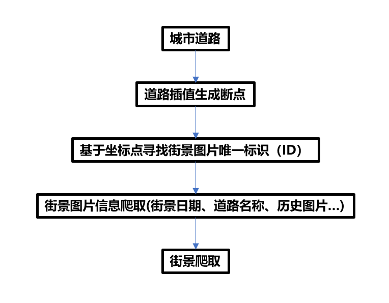
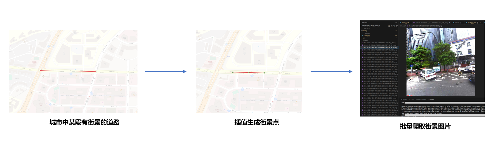
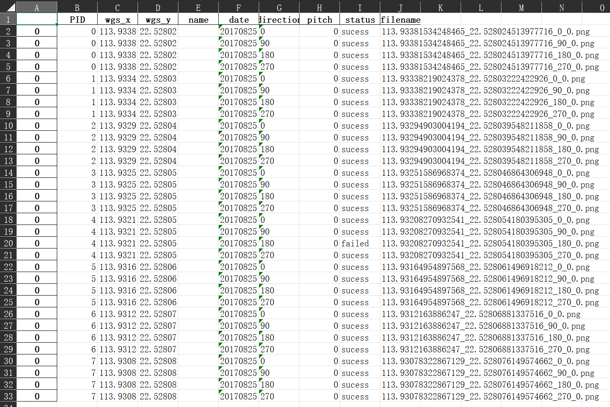

ENGLISH [中文版](./zh-ch.md)

# SREETVIEW_IMAGES_CRAWLER

## Crawling Approach and Principle:：

        <i>Technical Approach.</i>

        <i>Implementation Principle.</i>

## Instructions：

### Execution Order：

> Updated 09/13 2023. Spider can only crawl images in specific year. Config it in config.py (eg. setting IMAGE_YEAR = 2017 to crawl images generated in 2017)

- Configure your personal Baidu Map Key in config/config.py (Need to register an account on the Baidu Map official website to obtain it)
- Modify the data path in main.py
- Execute main.py

### Content

- The naming convention for crawled files is {wgs84*lng}{wgs84_lat}{direction}*{pitch}, where direction indicates the angle of the 360° street view image (0 represents the forward direction) and pitch represents the pitch angle.
- The directories that need manual configuration are config/config.py and main.py. Other technical files generally do not require additional configuration.
- In main.py, pay attention to the input data type. If you are using city road network data, you need to call the points_from_road function in main.py and use the generated points (pnts) to call the run function. If you are using precise point data of street view locations, you can directly call the run function.
- The recorder is the final output of crawled data in an Excel format.
- The dir folder contains some example data, such as dir/shp/roads.shp for example roads, and points for example points.
- After the crawling process is completed, crawl_recorder.xlsx will be generated in the dir folder, which records the crawling results of all coordinate points.
- The images folder is the folder where the crawled street view results are saved.

### Environment Dependencies：

- Python 3.8 or above
- Required third-party libraries: pandas, geopandas, tqdm, etc.

### Notes:

- The starting file for initiating the crawler must be in the geodataframe format with point data.
- The WGS84 coordinates will be automatically converted to Baidu coordinates using the wgs2bd09mc function in the program, so no additional operations are required.
- The naming convention for street view files is longitude_latitude_angle_pitch. If the crawl is successful, each point will have street view images at 0°, 90°, 180°, and 270°.

### References：

- Yao, Y., Liang, Z., Yuan, Z., Liu, P., Bie, Y., Zhang, J., ... & Guan, Q. (2019). A human-machine adversarial scoring framework for urban perception assessment using street-view images. International Journal of Geographical Information Science, 33(12), 2363-2384.

## Disclaimer：

This crawler code is intended for personal learning and research purposes only. Please do not use it for any non-scientific or illegal purposes.

## Concat:

Feel free to contact for technical discussions(kingsleyl0107@gmail.com)
