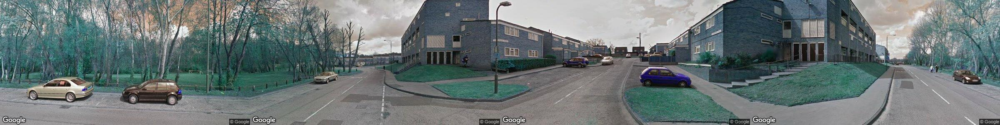

# Google StreetView Crawler

本脚本可以爬取最新及**历史**谷歌街景图片。
官方 API 仅允许爬取最新谷歌街景

本仓库由作业抽离，因此输入格式不具有普遍性，但只要有代表每个坐标点位的 LON 及 LAT 的两列，经过转换为 dataframe 都可以简单修改代码后运行。

### StartUp

- 爬取历史街景：在 config 中将 LATEST 参数修改为 false，输入你最想爬取的目标年份 Feature_Year,将 Accident_path 修改为你的点位数据，脚本会自动爬取距离你目标年份时间最接近的谷歌街景图片

- 爬取最新街景：在 config 中将 Laterst 参数设置为 True，脚本爬取 API 提供的最新图片，即在谷歌地图中可以看到的街景图

### Execute start.py

当 config 配置完成，数据路径摆放无误后，运行 start.py

### Performance

本脚本自动将每个点位的四个方位[0,90,180,270]进行图像拼接，生成一张全景图片
